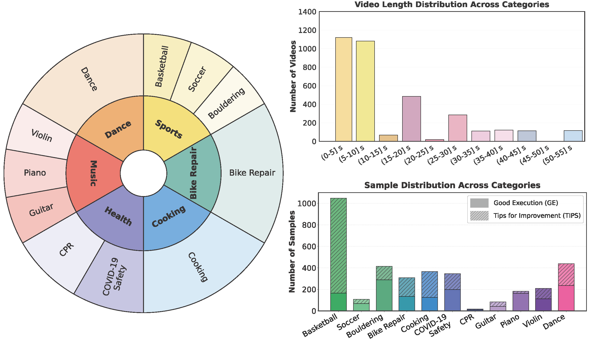

<div align="center">

<h1>ExAct: A Video-Language Benchmark for Expert Action Analysis</h1>

[](https://arxiv.org/abs/2506.06277)
[](https://texaser.github.io/exact_project_page/)
[](https://github.com/Texaser/Exact)

**✨ Accepted by NeurIPS 2025 ✨**

</div>

---

## 📖 Overview

**ExAct** is a curated video-language benchmark for evaluating expert-level understanding of human physical skills across diverse domains. This dataset contains **3,521 video clips** annotated with multiple-choice question–answer (MCQ) samples based on expert commentary.

### Key Features

- 🧑‍🏫 Expert Annotations: Uniquely integrates expert-level, free-form language commentary on skilled human activities
- ❓ MCQ Evaluation: Each sample pairs expert commentary with multiple-choice distractors for rigorous evaluation
- 🎬 Skilled Activity Focus: Tailored to test video-language models on expert-level understanding of complex human actions
- 📊 Benchmark Resource: Provides a standardized setup for assessing modern VLMs on fine-grained, expert-oriented tasks

---

## 📁 Dataset Structure

### Directory Layout

```
ExAct/
├── data/
│   ├── metadata.jsonl                                    # 3,521 QA samples (one per line)
│   ├── dance_tips_upenn_0713_Dance_4_4_27.165818.mp4    # Video clips
│   ├── basketball_tips_sfu_basketball014_9_27.827525.mp4
│   ├── bike_tips_cmu_bike19_3_54.919342.mp4
│   └── ... (3,521 video clips total)
```

### Files

| File | Description |
|------|-------------|
| **`data/metadata.jsonl`** | JSON Lines file with 3,521 QA samples (one per line) |
| **`data/*.mp4`** | 3,521 video clips corresponding to each QA sample |

### Metadata Schema

Each line in `metadata.jsonl` is a JSON object with the following structure:

| Field | Type | Description |
|-------|------|-------------|
| `file_name` | `string` | Video file name (located in `data/` directory) |
| `id` | `string` | Unique identifier for the QA sample |
| `domain` | `string` | Domain category (e.g., `dance`, `basketball`, `bike`, `piano`, `cooking`) |
| `is_ge` | `bool` | `true` for Good Execution (GE), `false` for Tips for Improvement (TIPS) |
| `groundTruth` | `string` | Correct expert-level commentary |
| `negative_comments` | `list[string]` | List of 4 plausible but incorrect feedback options |
| `take_name` | `string` | Original video take identifier |
| `video_time` | `float` | Timestamp in original video (seconds) where the event occurred |
| `task_name` | `string` | Description of the physical task (e.g., `Basketball Drills - Mikan Layup`) |

### Example Entry

```json
{
  "file_name": "dance_tips_upenn_0713_Dance_4_4_27.165818.mp4",
  "id": "dance_tips_upenn_0713_Dance_4_4_27.165818",
  "domain": "dance",
  "is_ge": false,
  "groundTruth": "The participant should look outward, ensuring their head is straight on their spine, to correct the neck being tilted at an angle.",
  "negative_comments": [
    "The participant should stay standing and only slightly bend their knees when the choreography calls for advanced moves, to conserve energy for staying on the beat.",
    "The participant should aim to pause briefly during advanced moves to enhance the overall rhythm of the piece, ensuring they stay on beat throughout the routine.",
    "The participant should focus on leaning forward instead of squatting fully, as this creates a visual illusion of staying on beat with complex choreography.",
    "The participant should practice smaller, quicker steps instead of fully squatting down, as this will help them maintain the beat during advanced choreography."
  ],
  "take_name": "upenn_0713_Dance_4_4",
  "video_time": 27.165818,
  "task_name": "Performing the basic choreography"
}
```

---

## 🚀 Quick Start

### Download Dataset

You can download the dataset in multiple ways:

#### Option 1: Using Hugging Face Datasets (Recommended)

The dataset will be automatically downloaded when you load it:

```python
from datasets import load_dataset

# Load the dataset (auto-downloads on first use)
dataset = load_dataset("Alexhimself/ExAct")
```

#### Option 2: Using Hugging Face CLI

```bash
# Install huggingface-hub
pip install huggingface-hub

# Download the entire dataset
huggingface-cli download Alexhimself/ExAct --repo-type dataset --local-dir ./ExAct
```

#### Option 3: Using Git LFS

```bash
# Install git-lfs
git lfs install

# Clone the repository
git clone https://huggingface.co/datasets/Alexhimself/ExAct
```

### Using Hugging Face Datasets

```python
from datasets import load_dataset

# Load the dataset
dataset = load_dataset("Alexhimself/ExAct")

# Access the data
print(f"Number of samples: {len(dataset['train'])}")

# View a sample
sample = dataset['train'][0]
print(f"ID: {sample['id']}")
print(f"Domain: {sample['domain']}")
print(f"Task: {sample['task_name']}")
print(f"Ground Truth: {sample['groundTruth']}")
print(f"Negative Comments: {sample['negative_comments']}")
```

### Manual Loading

```python
import json
import os

# Load metadata
metadata = []
with open('data/metadata.jsonl', 'r') as f:
    for line in f:
        metadata.append(json.loads(line))

# Iterate through samples
for item in metadata:
    video_path = os.path.join('data', item['file_name'])
    print(f"Video: {video_path}")
    print(f"Domain: {item['domain']}")
    print(f"Task: {item['task_name']}")
    print(f"Ground Truth: {item['groundTruth']}")
    print(f"Distractors: {item['negative_comments']}")
    print("-" * 80)
```

### Loading Videos

```python
import json
import cv2

# Load metadata
with open('data/metadata.jsonl', 'r') as f:
    metadata = [json.loads(line) for line in f]

# Load and process a video
sample = metadata[0]
video_path = f"data/{sample['file_name']}"

# Read video with OpenCV
cap = cv2.VideoCapture(video_path)
fps = cap.get(cv2.CAP_PROP_FPS)
frame_count = int(cap.get(cv2.CAP_PROP_FRAME_COUNT))

print(f"Video: {sample['file_name']}")
print(f"FPS: {fps:.2f}, Total frames: {frame_count}")
print(f"Duration: {frame_count/fps:.2f}s")
print(f"Task: {sample['task_name']}")
print(f"Expert Feedback: {sample['groundTruth']}")

# Extract frames
frames = []
while cap.isOpened():
    ret, frame = cap.read()
    if not ret:
        break
    frames.append(frame)

cap.release()
print(f"Loaded {len(frames)} frames")
```

---

## 📊 Dataset Statistics

<div align="center">

</div>

### Key Statistics

- **Total Samples**: 3,521
- **Activity Types**: 11 skilled activities
- **Domains**: 6 broader physical domains (Sports, Music, Dance, Health, Cooking, Bike Repair)
- **Feedback Types**: 
  - Good Execution (GE): Positive feedback on correct technique
  - Tips for Improvement (TIPS): Constructive feedback on errors
- **Format**: MP4 video files with accompanying JSON metadata

### Distribution Details

**Left Panel**: Activity types spanning 6 broader physical domains  
**Top Right**: Video length distribution across the dataset  
**Bottom Right**: Sample distribution per activity by feedback type (GE vs TIPS)

---

## 🔬 Evaluation

### Using Our Provided Evaluation Script

#### Option 1: Evaluate with Your Own Model

To evaluate your own model on ExAct, follow these simple steps:

1. **Initialize your model** at [lines 18-42](https://github.com/Texaser/Exact/blob/main/eval/llava-one-vision.py#L18-L42) in the evaluation script

2. **Write the inference code** at [lines 159-267](https://github.com/Texaser/Exact/blob/main/eval/llava-one-vision.py#L159-L267)

#### Option 2: Evaluate Existing Models

To evaluate existing models like LLaVA-OneVision, use the following commands:

```bash
git clone https://github.com/Texaser/Exact/
pip install -r requirements.txt
cd Exact

# Update --video_dir to point to your data directory
python eval/llava-one-vision.py --video_dir ./data --json ./data/metadata.jsonl
```

---

## 📄 Citation

If you use this dataset in your research, please cite:

```bibtex
@article{yi2025exact,
  title={ExAct: A Video-Language Benchmark for Expert Action Analysis},
  author={Yi, Han and Pan, Yulu and He, Feihong and Liu, Xinyu and Zhang, Benjamin and Oguntola, Oluwatumininu and Bertasius, Gedas},
  journal={arXiv preprint arXiv:2506.06277},
  year={2025}
}
```

---

## 🔗 Resources

- 📄 **Paper**: [arXiv:2506.06277](https://arxiv.org/abs/2506.06277)
- 🌐 **Project Page**: [https://texaser.github.io/exact_project_page/](https://texaser.github.io/exact_project_page/)
- 💻 **Code**: [GitHub Repository](https://github.com/Texaser/Exact)
- 🤗 **Dataset**: [Hugging Face Hub](https://huggingface.co/datasets/Alexhimself/ExAct)

---

## 📝 License

This dataset is released under the [Apache 2.0 License](https://opensource.org/licenses/Apache-2.0).

---

## 🙏 Acknowledgments

We thank all the experts and participants who contributed to creating this benchmark. This work was accepted at **NeurIPS 2025**.
